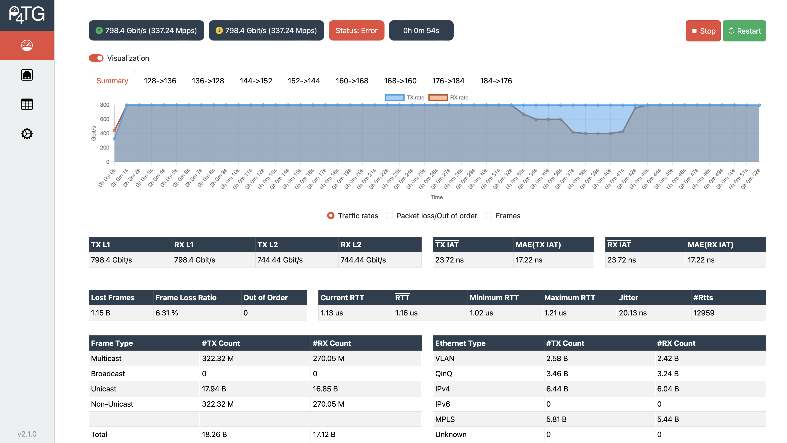

  

# P4TG: 1 Tb/s Traffic Generation for Ethernet/IP Networks

This repository contains the source code for a P4 based 1 Tb/s traffic generator based on the Intel Tofino(TM) ASIC.

In generation mode, P4TG is capable of generating traffic up to 1 Tb/s split across 10x 100 Gb/s ports. Thereby it measures rates directly in the data plane. Generated traffic may be fed back from the output to the input ports, possibly through other equipment, to record packet loss, packet reordering, and sampled IAT and RTT. In analysis mode, P4TG measures rates on the input ports, samples IAT, and forwards traffic through its output ports.

P4TG consist of:

- a P4 program for the Intel Tofino(TM)
- Python control plane
- React configuration GUI

## Installation & Start Instructions

### P4 Program

Compile p4tg via `make compile`. This compiles the program and copies the resulting configs to the target directory.

Afterwards, start p4tg via `make start`.

This requires a fully setup SDE with set `$SDE` and `$SDE_INSTALL` environment variables.

Tested on:
  - SDE 9.9.0
  - SDE 9.13.0

### Controller

The controller is written in python and can be started via docker-compose.
First, adjust the second volume in the `docker-compose.yml` that maps the local `$SDE` python path to the container.
This path depends on the `$SDE` installation and is required to make the python SDE modules available in the container.

Afterwards, start the controller via `docker-compose up`.

The controller then starts a REST-API server at port 8000 that is used to communicate with the configuration GUI.

### Configuration GUI

The configuration GUI is based on react & nodejs.
It can be either started via docker-compose or via npm.

#### Docker

To run the configuration GUI via docker-compose run `docker-compose up`.
After the build has finished, the configuration GUI is reachable at `http://127.0.0.1`.
To change the listening port adjust the port in `docker-compose.yml`.

#### Legacy NPM installation

Run `npm install --legacy-peer-deps` to install the nodejs dependencies.
Afterwards run `npm run build` to create a production build and serve the `build/` directory with a webserver of your choice.

#### Connection to REST-API server

Connect to the REST-API server through the frontend of the configuration GUI: http://*ip-of-tofino-controller*:8000

# Documentation

**Code Documentation follows soon.**

## Preview of P4TG

